# Диаграмма классов 

```mermaid
classDiagram
    class Machines{
        <<Table>>
        +int ID_станка [PK]
        +varchar(50) Номер_станка
        +varchar(100) Модель
        +date Дата_последнего_ремонта
        +float Среднеквадратичное_отклонение
        +varchar(50) Текущее_состояния
    }

    class Sensors{
        <<Table>>
        +int ID_датчика [PK]
        +int ID_станка [FK]
        +varchar(100) Тип_датчика
        +varchar(200) Диагностическая_точка
        +date Дата_установки
        +float Порог_аномалии
    }

    class MaintenanceTasks{
        <<Table>>
        +int ID_задачи [PK]
        +int ID_станка [FK]
        +int ID_ответственного [FK]
        +varchar(100) Тип_ТО
        +date Плановая_дата
        +date Фактическая_дата
        +varchar(50) Статус
        +text Описание
    }

    class Users{
        <<Table>>
        +int ID_пользователя [PK]
        +varchar(50) Логин
        +varchar(255) Пароль
        +bool Активен
    }

    class Workers{
        <<Table>>
        +int ID_работника [PK]
        +int ID_пользователя [FK]
        +varchar(200) ФИО
        +varchar(100) Должность
        +varchar(100) Отдел
        +varchar(200) Контакты
    }

    class VibrationData{
        <<Table>>
        +int ID_записи [PK]
        +int ID_датчика [FK]
        +datetime Дата_время
        +float Ускорение_X
        +float Ускорение_Y
        +float Ускорение_Z
    }

    class TaskStatus{
        <<Table>>
        +int ID_статуса [PK]
        +int ID_задачи [FK]
        +int ID_статуса_из_Statuses [FK]
        +datetime Дата_изменения
        +int ID_сотрудника [FK]
        +text Комментарий
    }

    class Statuses{
        <<Table>>
        +int ID_статуса [PK]
        +varchar(50) Название_статуса
        +text Описание_статуса
    }

    class RepairSchedule{
        <<Table>>
        +int ID_записи [PK]
        +int ID_станка [FK]
        +varchar(100) Тип_ТО
        +date Дата_Последнего_ТО
        +date Предполагаемая_Дата_Следующего_ТО
        +float Процент_Дефектности
        +varchar(50) Состояние
    }

    class Roles{
        <<Table>>
        +int ID_роли [PK]
        +varchar(100) Название_роли
        +text Описание_роли
    }

    class UserRoles{
        <<Table>>
        +int ID_связи [PK]
        +int ID_пользователя [FK]
        +int ID_роли [FK]
    }

    class Permissions{
        <<Table>>
        +int ID_права [PK]
        +varchar(200) Название_права
        +text Описание_права
    }

    class RolePermissions{
        <<Table>>
        +int ID_связи [PK]
        +int ID_роли [FK]
        +int ID_права [FK]
    }

    class LoginLog{
        <<Table>>
        +int ID_записи [PK]
        +int ID_пользователя [FK]
        +datetime Время_входа
        +datetime Время_выхода
        +varchar(100) IP_адрес
        +bool Успешная_авторизация
    }

    class Sessions{
        <<Table>>
        +varchar(255) SessionID [PK]
        +int ID_пользователя [FK]
        +datetime Время_начала
        +datetime Время_окончания
        +varchar(100) IP_адрес
    }

    Machines "1" -- "*" Sensors: содержит
    Machines "1" -- "*" MaintenanceTasks: связана_с
    Machines "1" -- "1" RepairSchedule: имеет
    MaintenanceTasks "1" -- "1" Workers: назначена_на
    MaintenanceTasks "1" -- "*" TaskStatus: имеет
    Sensors "1" -- "*" VibrationData: передает_данные
    Statuses "1" -- "*" TaskStatus: содержит
    Users "1" -- "1" Workers: связано_с
    Users "1" -- "*" UserRoles: имеет
    Roles "1" -- "*" UserRoles: назначено
    Roles "1" -- "*" RolePermissions: содержит
    Permissions "1" -- "*" RolePermissions: назначены
    Users "1" -- "*" LoginLog: журнал
    Users "1" -- "*" Sessions: сессии
 
```



## Примеры SQL-запросов

### 1. Получение полной информации о задаче технического обслуживания

```sql
SELECT 
    mt.ID_задачи,
    m.Номер_станка,
    w.ФИО AS Ответственный,
    r.Название_роли AS Роль_ответственного,
    mt.Тип_TO,
    mt.Плановая_дата,
    mt.Фактическая_дата,
    s.Название_статуса AS Текущий_статус,
    ts.Дата_изменения,
    ts.Комментарий
FROM 
    MaintenanceTasks mt
JOIN 
    Machines m ON mt.ID_станка = m.ID_станка
JOIN 
    Workers w ON mt.ID_ответственного = w.ID_работника
JOIN 
    Roles r ON w.Должность = r.Название_роли
JOIN 
    TaskStatus ts ON mt.ID_задачи = ts.ID_задачи
JOIN 
    Statuses s ON ts.ID_статуса_из_Statuses = s.ID_статуса
WHERE 
    mt.ID_задачи = @TaskID;
```
### 2. Получение полной информации о ткацком станке
```sql
SELECT 
    m.ID_станка,
    m.Номер_станка,
    m.Модель,
    m.Дата_последнего_ремонта,
    m.Среднеквадратичное_отклонение,
    m.Текущее_состояния,
    rs.Тип_ТО AS Предстоящий_ремонт,
    rs.Предполагаемая_Дата_Следующего_ТО,
    COUNT(s.ID_датчика) AS Количество_датчиков
FROM 
    Machines m
LEFT JOIN 
    RepairSchedule rs ON m.ID_станка = rs.ID_станка
LEFT JOIN 
    Sensors s ON m.ID_станка = s.ID_станка
WHERE 
    m.ID_станка = @MachineID
GROUP BY 
    m.ID_станка, rs.Тип_ТО, rs.Предполагаемая_Дата_Следующего_ТО;
```
### 3. Получение полной информации о пользователе

```sql
SELECT 
    u.ID_пользователя,
    u.Логин,
    w.ФИО,
    w.Отдел,
    w.Должность,
    STRING_AGG(r.Название_роли, ', ') AS Роли,
    COUNT(l.ID_записи) AS Количество_входов,
    MAX(l.Время_входа) AS Последний_вход
FROM 
    Users u
LEFT JOIN 
    Workers w ON u.ID_пользователя = w.ID_пользователя
LEFT JOIN 
    UserRoles ur ON u.ID_пользователя = ur.ID_пользователя
LEFT JOIN 
    Roles r ON ur.ID_роли = r.ID_роли
LEFT JOIN 
    LoginLog l ON u.ID_пользователя = l.ID_пользователя
WHERE 
    u.ID_пользователя = @UserID
GROUP BY 
    u.ID_пользователя, u.Логин, w.ФИО, w.Отдел, w.Должность;
```

### 4. Получение истории изменений статуса задачи

```sql
SELECT 
    ts.ID_статуса,
    s.Название_статуса AS Статус,
    ts.Дата_изменения,
    w.ФИО AS Изменивший_статус,
    ts.Комментарий
FROM 
    TaskStatus ts
JOIN 
    Statuses s ON ts.ID_статуса_из_Statuses = s.ID_статуса
JOIN 
    Workers w ON ts.ID_сотрудника = w.ID_работника
WHERE 
    ts.ID_задачи = @TaskID
ORDER BY 
    ts.Дата_изменения DESC; 
```

### 5. Получение всех задач для конкретного работника

```sql
SELECT 
    mt.ID_задачи,
    m.Номер_станка,
    m.Модель,
    mt.Тип_ТО,
    mt.Плановая_дата,
    mt.Фактическая_дата,
    s.Название_статуса AS Текущий_статус
FROM 
    MaintenanceTasks mt
JOIN 
    Machines m ON mt.ID_станка = m.ID_станка
JOIN 
    TaskStatus ts ON mt.ID_задачи = ts.ID_задачи
JOIN 
    Statuses s ON ts.ID_статуса_из_Statuses = s.ID_статуса
WHERE 
    mt.ID_ответственного = @WorkerID; 
```

### Получение данных вибрации для конкретного станка

```sql
SELECT 
    v.ID_записи,
    v.Дата_время,
    v.Ускорение_X,
    v.Ускорение_Y,
    v.Ускорение_Z,
    s.Тип_датчика AS Датчик
FROM 
    VibrationData v
JOIN 
    Sensors s ON v.ID_датчика = s.ID_датчика
WHERE 
    s.ID_станка = @MachineID
ORDER BY 
    v.Дата_время DESC;
```

### 7. Проверка прав доступа пользователя

```sql
SELECT 
    p.Название_права
FROM 
    Permissions p
JOIN 
    RolePermissions rp ON p.ID_права = rp.ID_права
JOIN 
    Roles r ON rp.ID_роли = r.ID_роли
JOIN 
    UserRoles ur ON r.ID_роли = ur.ID_роли
WHERE 
    ur.ID_пользователя = @UserID;
```

### 8. Получение текущего состояния станка

```sql
SELECT 
    m.ID_станка,
    m.Номер_станка,
    m.Текущее_состояния,
    AVG(v.Ускорение_X) AS Среднее_ускорение_X,
    AVG(v.Ускорение_Y) AS Среднее_ускорение_Y,
    AVG(v.Ускорение_Z) AS Среднее_ускорение_Z,
    rs.Предполагаемая_Дата_Следующего_ТО
FROM 
    Machines m
LEFT JOIN 
    Sensors s ON m.ID_станка = s.ID_станка
LEFT JOIN 
    VibrationData v ON s.ID_датчика = v.ID_датчика
LEFT JOIN 
    RepairSchedule rs ON m.ID_станка = rs.ID_станка
WHERE 
    m.ID_станка = @MachineID
GROUP BY 
    m.ID_станка, m.Номер_станка, m.Текущее_состояния, rs.Предполагаемая_Дата_Следующего_ТО;
```

### 9. Получение списка задач, требующих выполнения

```sql
SELECT 
    mt.ID_задачи,
    m.Номер_станка,
    m.Модель,
    mt.Тип_ТО,
    mt.Плановая_дата,
    s.Название_статуса AS Текущий_статус
FROM 
    MaintenanceTasks mt
JOIN 
    Machines m ON mt.ID_станка = m.ID_станка
JOIN 
    TaskStatus ts ON mt.ID_задачи = ts.ID_задачи
JOIN 
    Statuses s ON ts.ID_статуса_из_Statuses = s.ID_статуса
WHERE 
    s.Название_статуса IN ('Открыта', 'В работе')
ORDER BY 
    mt.Плановая_дата ASC;
```