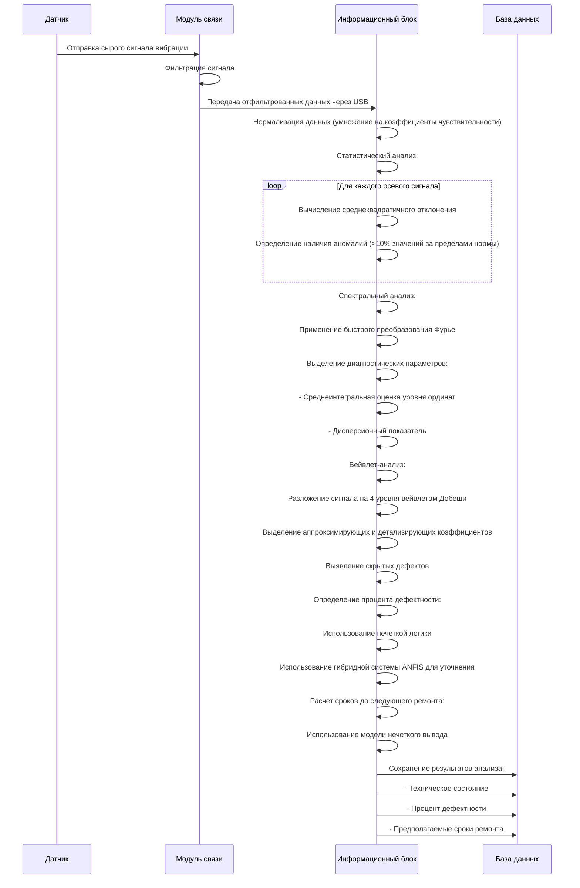

# Взаимодействие модулей при обработке данных

```mermaid
sequenceDiagram
    participant Sensor as Датчик
    participant Module as Модуль связи
    participant InfoBlock as Информационный блок
    participant DB as База данных
    
    Sensor->>Module: Отправка сырого сигнала вибрации
    Module->>Module: Фильтрация сигнала
    Module->>InfoBlock: Передача отфильтрованных данных через USB
    InfoBlock->>InfoBlock: Нормализация данных (умножение на коэффициенты чувствительности)
    
    InfoBlock->>InfoBlock: Статистический анализ:
    loop Для каждого осевого сигнала
        InfoBlock->>InfoBlock: Вычисление среднеквадратичного отклонения
        InfoBlock->>InfoBlock: Определение наличия аномалий (>10% значений за пределами нормы)
    end
    
    InfoBlock->>InfoBlock: Спектральный анализ:
    InfoBlock->>InfoBlock: Применение быстрого преобразования Фурье
    InfoBlock->>InfoBlock: Выделение диагностических параметров:
    InfoBlock->>InfoBlock: - Среднеинтегральная оценка уровня ординат
    InfoBlock->>InfoBlock: - Дисперсионный показатель
    
    InfoBlock->>InfoBlock: Вейвлет-анализ:
    InfoBlock->>InfoBlock: Разложение сигнала на 4 уровня вейвлетом Добеши
    InfoBlock->>InfoBlock: Выделение аппроксимирующих и детализирующих коэффициентов
    InfoBlock->>InfoBlock: Выявление скрытых дефектов
    
    InfoBlock->>InfoBlock: Определение процента дефектности:
    InfoBlock->>InfoBlock: Использование нечеткой логики
    InfoBlock->>InfoBlock: Использование гибридной системы ANFIS для уточнения
    
    InfoBlock->>InfoBlock: Расчет сроков до следующего ремонта:
    InfoBlock->>InfoBlock: Использование модели нечеткого вывода
    InfoBlock->>DB: Сохранение результатов анализа:
    InfoBlock->>DB: - Техническое состояние
    InfoBlock->>DB: - Процент дефектности
    InfoBlock->>DB: - Предполагаемые сроки ремонта
```