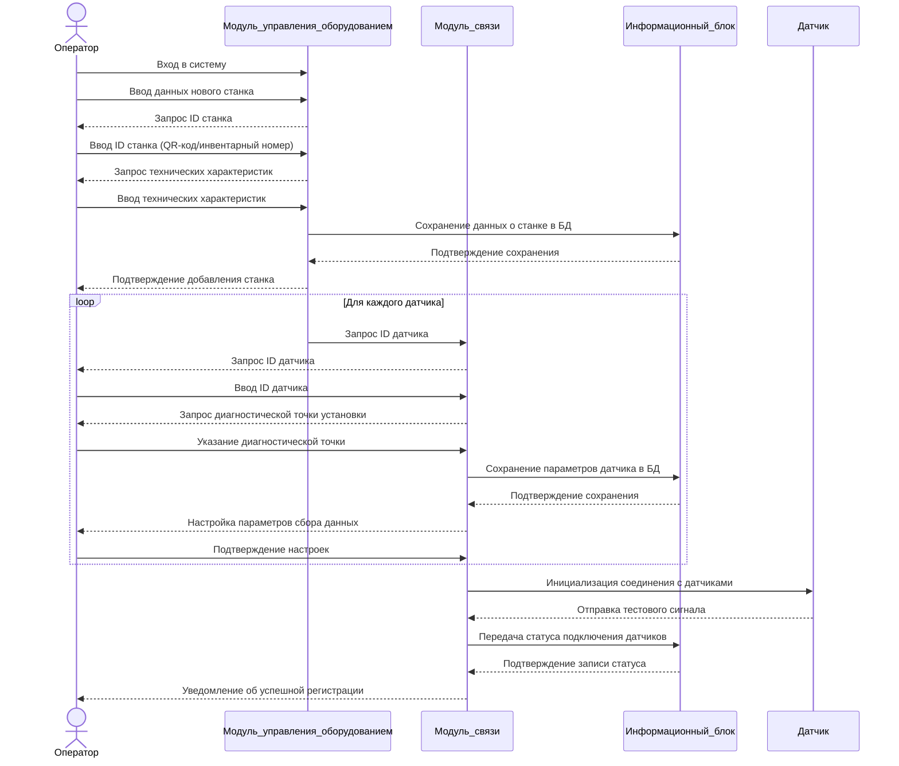

# Добавление нового ткацкого станка в систему

```mermaid
sequenceDiagram
    actor Operator as Оператор
    participant EquipmentService as Модуль_управления_оборудованием
    participant SensorService as Модуль_связи
    participant InfoBlock as Информационный_блок
    participant Sensor as Датчик

    %% Вход в систему и ввод данных нового станка
    Operator->>EquipmentService: Вход в систему
    Operator->>EquipmentService: Ввод данных нового станка
    EquipmentService-->>Operator: Запрос ID станка
    Operator->>EquipmentService: Ввод ID станка (QR-код/инвентарный номер)
    EquipmentService-->>Operator: Запрос технических характеристик
    Operator->>EquipmentService: Ввод технических характеристик
    EquipmentService->>InfoBlock: Сохранение данных о станке в БД
    InfoBlock-->>EquipmentService: Подтверждение сохранения
    EquipmentService-->>Operator: Подтверждение добавления станка

    %% Настройка датчиков для нового станка
    loop Для каждого датчика
        EquipmentService->>SensorService: Запрос ID датчика
        SensorService-->>Operator: Запрос ID датчика
        Operator->>SensorService: Ввод ID датчика
        SensorService-->>Operator: Запрос диагностической точки установки
        Operator->>SensorService: Указание диагностической точки
        SensorService->>InfoBlock: Сохранение параметров датчика в БД
        InfoBlock-->>SensorService: Подтверждение сохранения
        SensorService-->>Operator: Настройка параметров сбора данных
        Operator->>SensorService: Подтверждение настроек
    end

    %% Инициализация соединения с датчиками
    SensorService->>Sensor: Инициализация соединения с датчиками
    Sensor-->>SensorService: Отправка тестового сигнала
    SensorService->>InfoBlock: Передача статуса подключения датчиков
    InfoBlock-->>SensorService: Подтверждение записи статуса
    SensorService-->>Operator: Уведомление об успешной регистрации
```