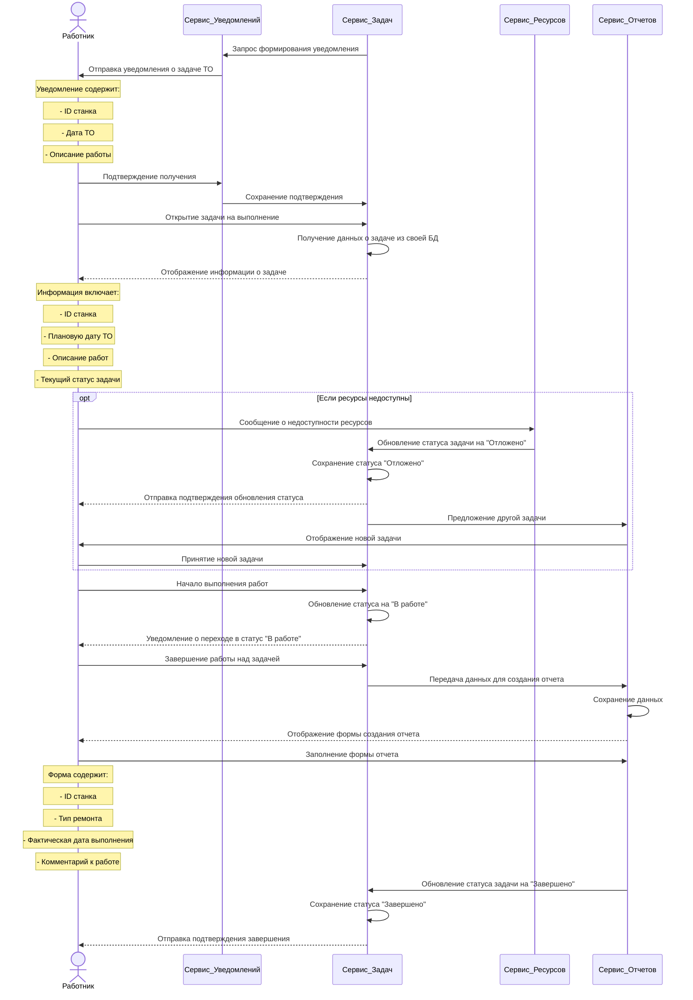

# Получение уведомления о назначенных сроках ТО

```mermaid
sequenceDiagram
    actor Worker as Работник
    participant NotificationService as Сервис_Уведомлений
    participant TaskService as Сервис_Задач
    participant ResourceService as Сервис_Ресурсов
    participant ReportService as Сервис_Отчетов

    %% Получение уведомления о задаче
    TaskService->>NotificationService: Запрос формирования уведомления
    NotificationService->>Worker: Отправка уведомления о задаче ТО
    note over Worker: Уведомление содержит:
    note over Worker: - ID станка
    note over Worker: - Дата ТО
    note over Worker: - Описание работы
    Worker->>NotificationService: Подтверждение получения
    NotificationService->>TaskService: Сохранение подтверждения

    %% Открытие задачи и начало выполнения
    Worker->>TaskService: Открытие задачи на выполнение
    TaskService->>TaskService: Получение данных о задаче из своей БД
    TaskService-->>Worker: Отображение информации о задаче
    note over Worker: Информация включает:
    note over Worker: - ID станка
    note over Worker: - Плановую дату ТО
    note over Worker: - Описание работ
    note over Worker: - Текущий статус задачи

    opt Если ресурсы недоступны
        Worker->>ResourceService: Сообщение о недоступности ресурсов
        ResourceService->>TaskService: Обновление статуса задачи на "Отложено"
        TaskService->>TaskService: Сохранение статуса "Отложено"
        TaskService-->>Worker: Отправка подтверждения обновления статуса
        TaskService->>ReportService: Предложение другой задачи
        ReportService->>Worker: Отображение новой задачи
        Worker->>TaskService: Принятие новой задачи
    end

    Worker->>TaskService: Начало выполнения работ
    TaskService->>TaskService: Обновление статуса на "В работе"
    TaskService-->>Worker: Уведомление о переходе в статус "В работе"

    %% Завершение задачи и создание отчета
    Worker->>TaskService: Завершение работы над задачей
    TaskService->>ReportService: Передача данных для создания отчета
    ReportService->>ReportService: Сохранение данных
    ReportService-->>Worker: Отображение формы создания отчета
    Worker->>ReportService: Заполнение формы отчета
    note over Worker: Форма содержит:
    note over Worker: - ID станка
    note over Worker: - Тип ремонта
    note over Worker: - Фактическая дата выполнения
    note over Worker: - Комментарий к работе

    %% Сохранение результатов
    ReportService->>TaskService: Обновление статуса задачи на "Завершено"
    TaskService->>TaskService: Сохранение статуса "Завершено"
    TaskService-->>Worker: Отправка подтверждения завершения
```