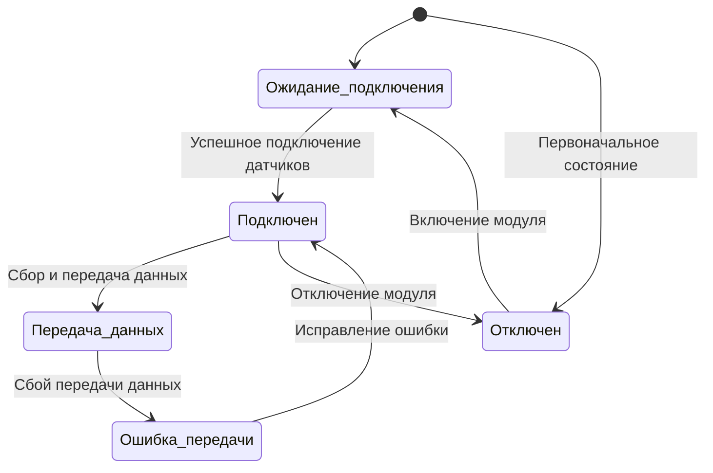

# Диаграмма состояний модуля связи
## Модуль связи может находиться в следующих состояниях:

 * Ожидаение подключения : Модуль ждет подключения датчиков.
 * Подключен : Модуль связан с датчиками.
 * Передача данных : Модуль передает данные в информационный блок.
 * Ошибка передачи : Произошла ошибка при передаче данных.
 * Отключен : Модуль выключен.

## Описание:

1. Модуль начинает работу в состоянии "Ожидание подключения".
2. После подключения датчиков модуль переходит в состояние "Подключен".
3. Если данные успешно передаются, модуль находится в состоянии "Передача данных".
4. При возникновении ошибки передачи модуль переходит в состояние "Ошибка передачи".
5. Модуль может быть отключен вручную или автоматически.