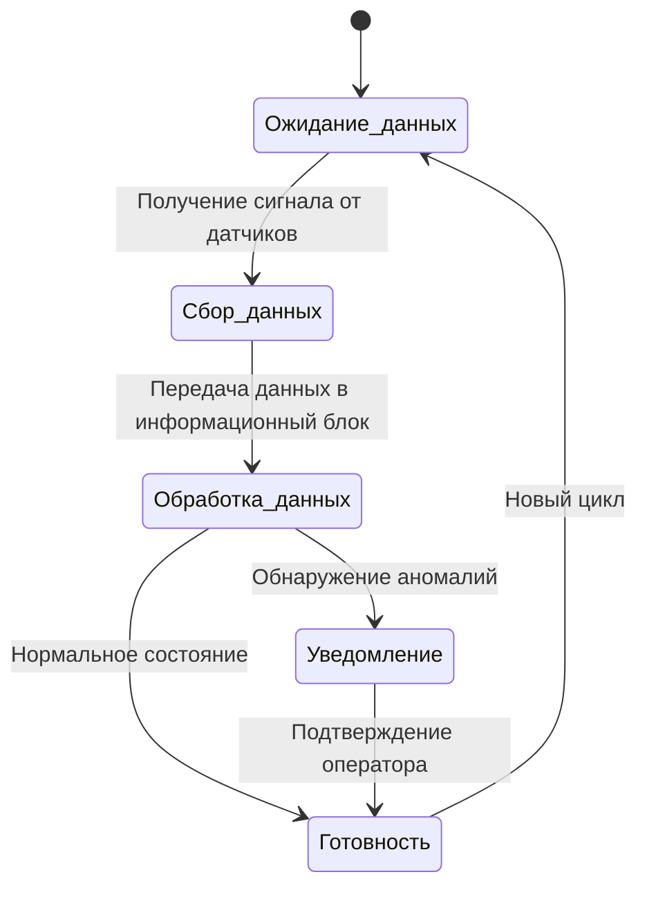

# Диаграмма состояний диагностической системы
## Диагностическая система может находиться в следующих состояниях:

 * Ожидание данных : Система ждет поступления данных от датчиков.
 * Сбор данных : Система собирает данные о вибрации.
 * Обработка данных : Система анализирует данные.
 * Уведомление : Система отправила уведомление о проблеме.
 * Готовность : Система готова к новому циклу сбора данных.

## Описание:

1. Система начинает работу в состоянии "Ожидание данных".
2. Когда данные поступают от датчиков, система переходит в состояние "Сбор данных".
3. После сбора происходит "Обработка данных".
4. Если обнаруживаются аномалии, система переходит в состояние "Уведомление" и оповещает оператора.
5. Если все в порядке, система переходит в состояние "Готовность".
6. После подтверждения оператора система возвращается в состояние "Ожидание данных".