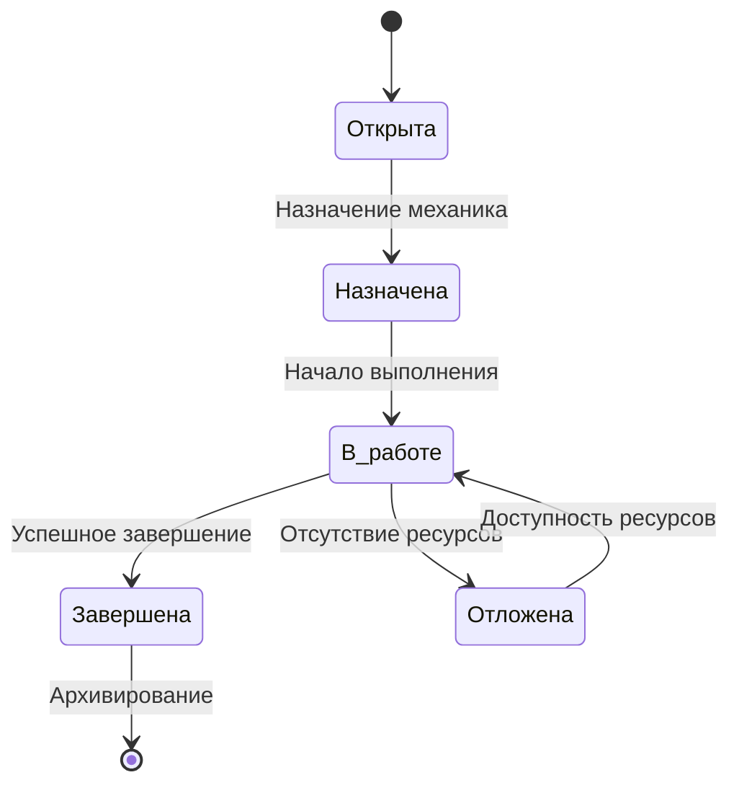

# Диаграмма состояний задачи технического обслуживания
## Задача ТО может находиться в следующих состояниях:

 * Открыта : Задача создана, но еще не назначена.
 * Назначена : Задача назначена механику.
 * В работе : Механик выполняет задачу.
 * Завершена : Задача успешно выполнена.
 * Отложена : Задача отложена из-за отсутствия ресурсов.

## Описание:

1. Задача создается в состоянии "Открыта".
2. После назначения механика задача переходит в состояние "Назначена".
3. Когда механик начинает выполнение, задача становится "В работе".
4. Если возникают проблемы (например, отсутствие запчастей), задача может быть 4. отложена.
5. После завершения задача архивируется.