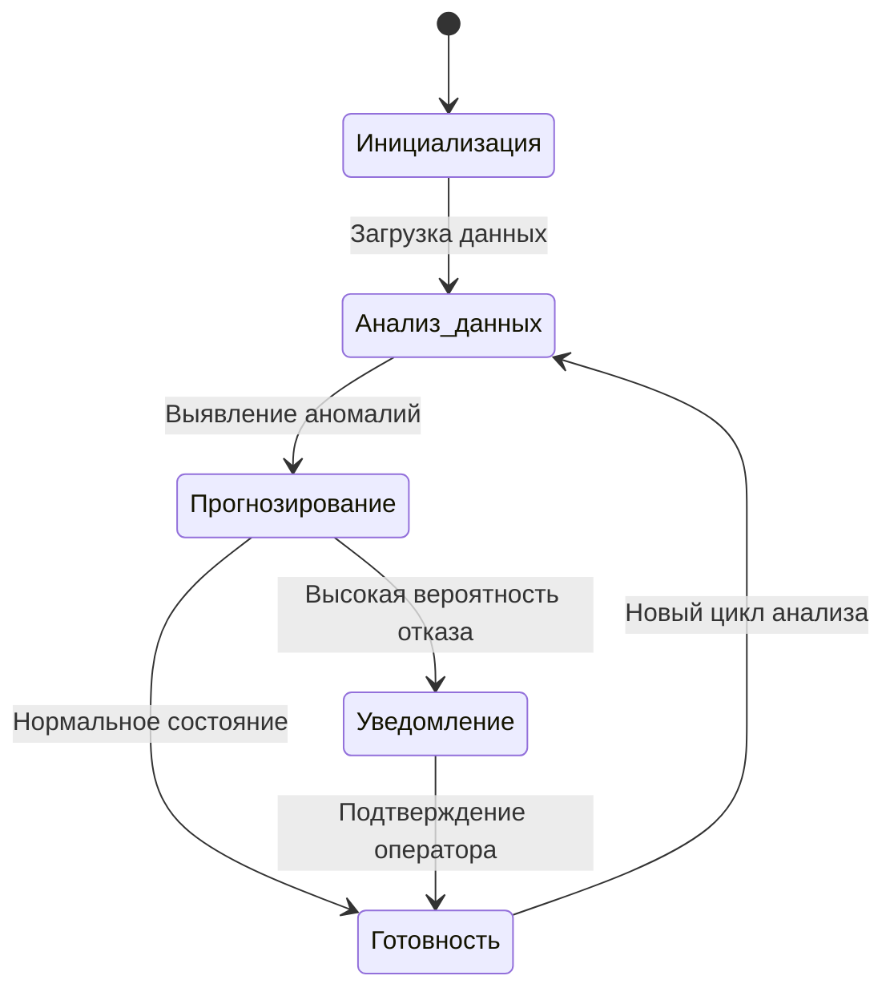

# Диаграмма состояний системы прогнозирования ремонтов
## Система прогнозирования ремонтов может находиться в следующих состояниях:

 * Инициализация : Система загружается.
 * Анализ данных : Система проводит анализ текущих параметров.
 * Прогнозирование : Система прогнозирует сроки ремонта.
 * Уведомление : Система отправляет уведомление о необходимости ремонта.
 * Готовность : Система завершила текущий цикл анализа.

## Описание:

1. Система начинает работу с состояния "Инициализация".
2. После загрузки данных система переходит в состояние "Анализ данных".
3. На основе анализа система переходит либо в "Прогнозирование", либо сразу в "Готовность".
4. Если прогноз показывает необходимость ремонта, система переходит в состояние "Уведомление".
5. После подтверждения оператора система возвращается в состояние "Готовность" и начинает новый цикл.
