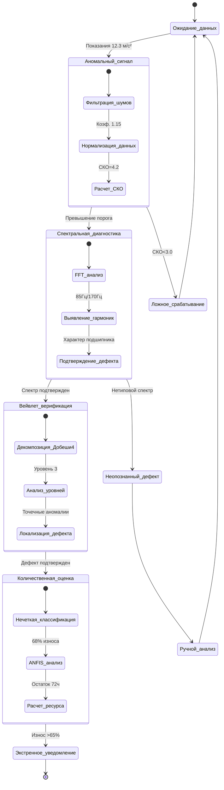

# Диаграмма состояний системы прогнозирования ремонтов
## Система прогнозирования ремонтов может находиться в следующих состояниях:

 * Инициализация : Система загружается.
 * Анализ данных : Система проводит анализ текущих параметров.
 * Прогнозирование : Система прогнозирует сроки ремонта.
 * Уведомление : Система отправляет уведомление о необходимости ремонта.
 * Готовность : Система завершила текущий цикл анализа.

```mermaid
stateDiagram-v2
    [*] --> Ожидание_данных
    
    Ожидание_данных --> Сбор_данных: Получение сигнала
    Сбор_данных --> Предварительная_обработка: Данные получены
    
    state Предварительная_обработка {
        [*] --> Фильтрация
        Фильтрация --> Нормализация
        Нормализация --> Форматирование
    }
    
    Предварительная_обработка --> Статистический_анализ: Данные подготовлены
    
    state Статистический_анализ {
        [*] --> Расчет_СКО
        Расчет_СКО --> Выявление_аномалий
        Выявление_аномалий --> Проверка_порогов
    }
    
    Статистический_анализ --> Спектральный_анализ: Аномалии обнаружены?
    
    state Спектральный_анализ {
        [*] --> FFT_преобразование
        FFT_преобразование --> Выделение_параметров
        Выделение_параметров --> Оценка_спектра
    }
    
    Спектральный_анализ --> Вейвлет_анализ: Спектр проанализирован
    
    state Вейвлет_анализ {
        [*] --> Разложение_Добеши
        Разложение_Добеши --> Анализ_коэффициентов
        Анализ_коэффициентов --> Выявление_дефектов
    }
    
    Вейвлет_анализ --> Диагностика_состояния: Дефекты выявлены
    
    state Диагностика_состояния {
        [*] --> Нечеткая_логика
        Нечеткая_логика --> ANFIS_анализ
        ANFIS_анализ --> Расчет_дефектности
    }
    
    Диагностика_состояния --> Прогнозирование_ремонта: % дефектности определен
    
    state Прогнозирование_ремонта {
        [*] --> Модель_нечеткого_вывода
        Модель_нечеткого_вывода --> Расчет_сроков
        Расчет_сроков --> Формирование_рекомендаций
    }
    
    Прогнозирование_ремонта --> Сохранение_результатов: Прогноз готов
    Сохранение_результатов --> [*]
    
    %% Альтернативные переходы
    Статистический_анализ --> Ожидание_данных: Нет аномалий
    Спектральный_анализ --> Ожидание_данных: Спектр в норме
    Вейвлет_анализ --> Ожидание_данных: Дефекты не найдены
```

Конкретная ситуация:
1. : Датчик LSM6DS3 зафиксировал повышенную вибрацию (ускорение 12.3 м/с² при норме 8.5 м/с²) на оси Y
2. Система выявила аномалию в среднеквадратичном отклонении (СКО=4.2 при норме 2.8)
3. Спектральный анализ показал характерные гармоники 85Гц и 170Гц (дефект внутреннего кольца подшипника)
4. Вейвлет-анализ подтвердил локальные дефекты на 3-м уровне декомпозиции
5. ANFIS-модель оценила износ в 68%
6. Система рекомендовала замену подшипника в течение 72 часов

# Ручной анализ :

- Визуальный осмотр оборудования:
- Проверка на наличие видимых повреждений (трещины, люфты, загрязнения)
- Контроль смазки подшипников
- Анализ состояния ремней, шестерен и других механических компонентов 