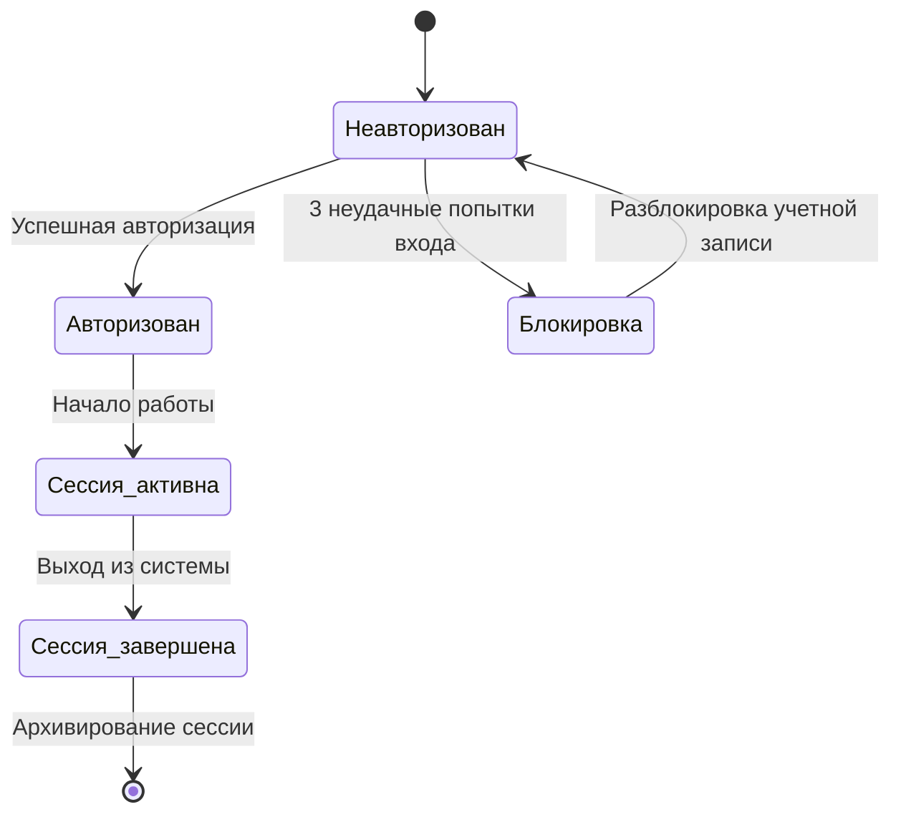

# Диаграмма состояний пользователя.
## Пользователь системы может находиться в следующих состояниях:

 * Неавторизован : Пользователь еще не вошел в систему.
 * Авторизован : Пользователь успешно вошел в систему.
 * Блокировка : Пользователь заблокирован из-за нескольких неудачных попыток входа.
 * Сессия активна : Пользователь работает с системой.
 * Сессия завершена : Пользователь вышел из системы.

## Описание:

1. Пользователь начинает взаимодействие с системой в состоянии "Неавторизован".
2. После успешной авторизации пользователь становится "Авторизован".
3. Если пользователь делает три неудачные попытки входа, его аккаунт блокируется.
4. После входа пользователь переходит в состояние "Сессия активна".
5. По завершении работы сессия закрывается.