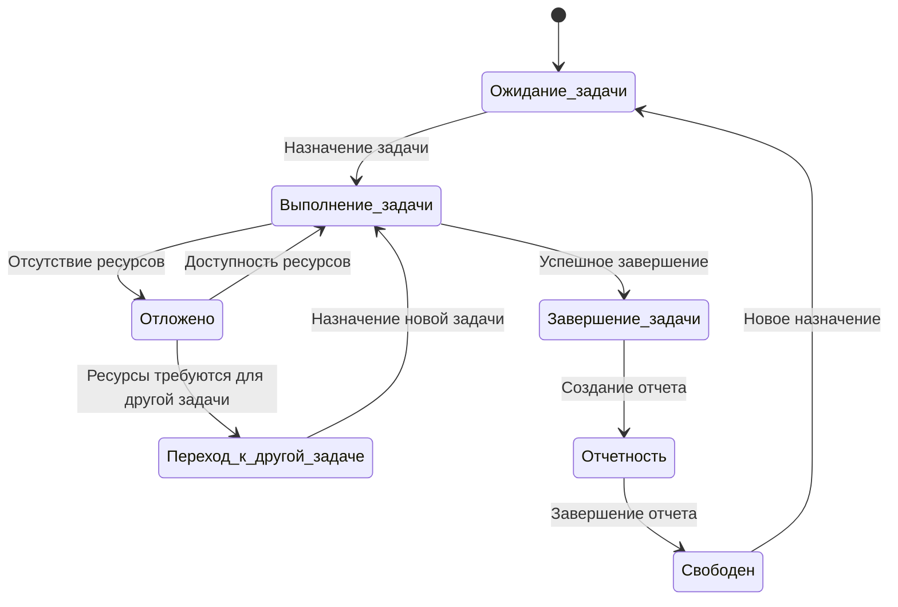

# Диаграмма состояний работника
## Работник может находиться в следующих состояниях:

 * Ожидание задачи : Работник ожидает назначения задачи.
 * Выполнение задачи : Работник выполняет задачу.
 * Переход к другой задаче : Работник был переназначен на другую задачу из-за отсутствия ресурсов для текущей задачи.
 * Завершение задачи : Работник завершил задачу.
 * Отчетность : Работник составляет отчет о выполненном ремонте.
 * Свободен : Работник свободен от задач.

## Описание:

1. Работник готов к приему новой задачи, не занят диагностикой или ремонтом. Задача назначается через систему или руководителем.
2. Работник диагностирует ткацкий станок, используя датчики вибрации (акселерометр LSM6DS3) и модуль связи . Собирает и анализирует данные для выявления дефектов. При нехватке ресурсов задача переходит в состояние "Отложено".
3. Задача откладывается из-за нехватки запчастей или инструментов. Работник фиксирует причину и ждет уведомления о доступности ресурсов. Система может предложить переключиться на другую задачу.
4. При отложении текущей задачи система назначает новую, если она доступна и соответствует квалификации работника. Работник возвращается к состоянию "Выполнение задачи".
5. После выполнения всех этапов работник фиксирует завершение, готовит документацию и передает оборудование в эксплуатацию. Затем переходит к "Отчетности".