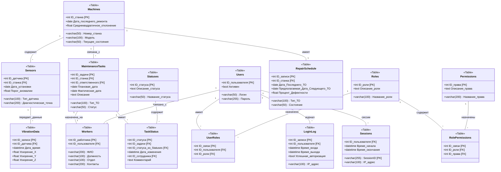

```mermaid
classDiagram
    class Machines{
        <<Table>>
        +int ID_станка [PK]
        +varchar(50) Номер_станка
        +varchar(100) Модель
        +date Дата_последнего_ремонта
        +float Среднеквадратичное_отклонение
        +varchar(50) Текущее_состояния
    }

    class Sensors{
        <<Table>>
        +int ID_датчика [PK]
        +int ID_станка [FK]
        +varchar(100) Тип_датчика
        +varchar(200) Диагностическая_точка
        +date Дата_установки
        +float Порог_аномалии
    }

    class MaintenanceTasks{
        <<Table>>
        +int ID_задачи [PK]
        +int ID_станка [FK]
        +int ID_ответственного [FK]
        +varchar(100) Тип_ТО
        +date Плановая_дата
        +date Фактическая_дата
        +varchar(50) Статус
        +text Описание
    }

    class Users{
        <<Table>>
        +int ID_пользователя [PK]
        +varchar(50) Логин
        +varchar(255) Пароль
        +bool Активен
    }

    class Workers{
        <<Table>>
        +int ID_работника [PK]
        +int ID_пользователя [FK]
        +varchar(200) ФИО
        +varchar(100) Должность
        +varchar(100) Отдел
        +varchar(200) Контакты
    }

    class VibrationData{
        <<Table>>
        +int ID_записи [PK]
        +int ID_датчика [FK]
        +datetime Дата_время
        +float Ускорение_X
        +float Ускорение_Y
        +float Ускорение_Z
    }

    class TaskStatus{
        <<Table>>
        +int ID_статуса [PK]
        +int ID_задачи [FK]
        +int ID_статуса_из_Statuses [FK]
        +datetime Дата_изменения
        +int ID_сотрудника [FK]
        +text Комментарий
    }

    class Statuses{
        <<Table>>
        +int ID_статуса [PK]
        +varchar(50) Название_статуса
        +text Описание_статуса
    }

    class RepairSchedule{
        <<Table>>
        +int ID_записи [PK]
        +int ID_станка [FK]
        +varchar(100) Тип_ТО
        +date Дата_Последнего_ТО
        +date Предполагаемая_Дата_Следующего_ТО
        +float Процент_Дефектности
        +varchar(50) Состояние
    }

    class Roles{
        <<Table>>
        +int ID_роли [PK]
        +varchar(100) Название_роли
        +text Описание_роли
    }

    class UserRoles{
        <<Table>>
        +int ID_связи [PK]
        +int ID_пользователя [FK]
        +int ID_роли [FK]
    }

    class Permissions{
        <<Table>>
        +int ID_права [PK]
        +varchar(200) Название_права
        +text Описание_права
    }

    class RolePermissions{
        <<Table>>
        +int ID_связи [PK]
        +int ID_роли [FK]
        +int ID_права [FK]
    }

    class LoginLog{
        <<Table>>
        +int ID_записи [PK]
        +int ID_пользователя [FK]
        +datetime Время_входа
        +datetime Время_выхода
        +varchar(100) IP_адрес
        +bool Успешная_авторизация
    }

    class Sessions{
        <<Table>>
        +varchar(255) SessionID [PK]
        +int ID_пользователя [FK]
        +datetime Время_начала
        +datetime Время_окончания
        +varchar(100) IP_адрес
    }

    Machines "1" -- "*" Sensors: содержит
    Machines "1" -- "*" MaintenanceTasks: связана_с
    Machines "1" -- "1" RepairSchedule: имеет
    MaintenanceTasks "1" -- "1" Workers: назначена_на
    MaintenanceTasks "1" -- "*" TaskStatus: имеет
    Sensors "1" -- "*" VibrationData: передает_данные
    Statuses "1" -- "*" TaskStatus: содержит
    Users "1" -- "1" Workers: связано_с
    Users "1" -- "*" UserRoles: имеет
    Roles "1" -- "*" UserRoles: назначено
    Roles "1" -- "*" RolePermissions: содержит
    Permissions "1" -- "*" RolePermissions: назначены
    Users "1" -- "*" LoginLog: журнал
    Users "1" -- "*" Sessions: сессии
 
```