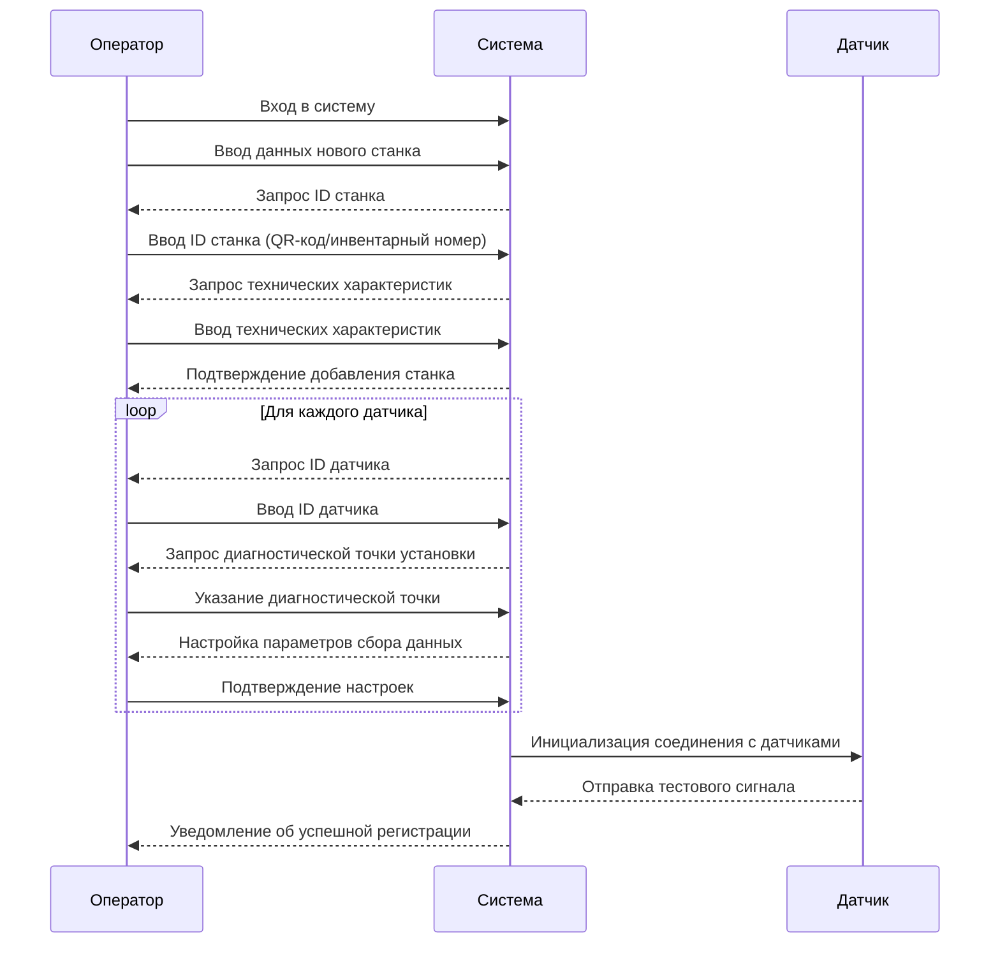

# Добавление нового станка в систему

```mermaid
sequenceDiagram
    participant Operator as Оператор
    participant System as Система
    participant Sensor as Датчик

    Operator->>System: Вход в систему
    Operator->>System: Ввод данных нового станка
    System-->>Operator: Запрос ID станка
    Operator->>System: Ввод ID станка (QR-код/инвентарный номер)
    System-->>Operator: Запрос технических характеристик
    Operator->>System: Ввод технических характеристик
    System-->>Operator: Подтверждение добавления станка

    loop Для каждого датчика
        System-->>Operator: Запрос ID датчика
        Operator->>System: Ввод ID датчика
        System-->>Operator: Запрос диагностической точки установки
        Operator->>System: Указание диагностической точки
        System-->>Operator: Настройка параметров сбора данных
        Operator->>System: Подтверждение настроек
    end

    System->>Sensor: Инициализация соединения с датчиками
    Sensor-->>System: Отправка тестового сигнала
    System-->>Operator: Уведомление об успешной регистрации
```