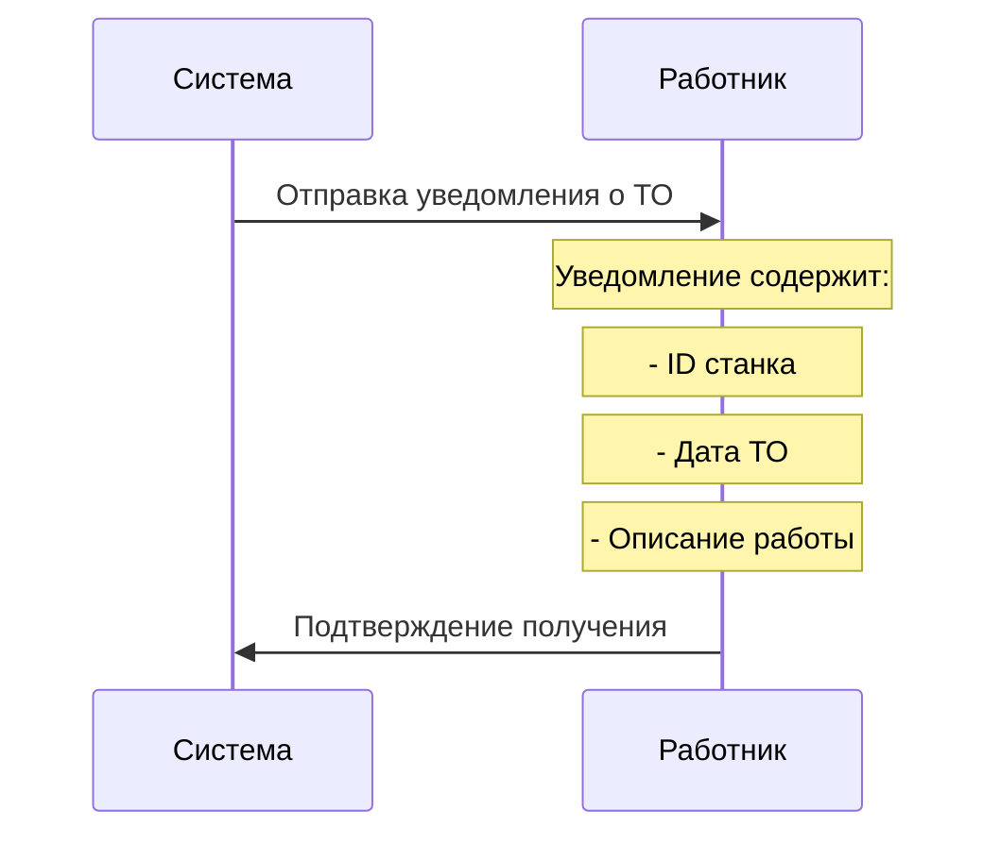
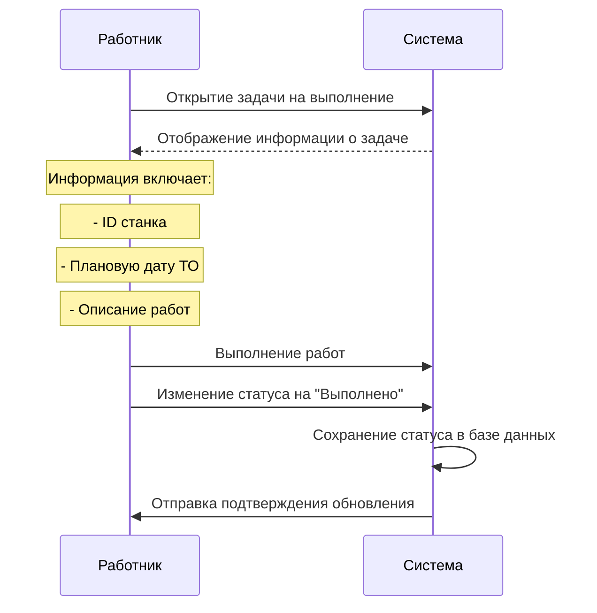

# Получение уведомления о назначенных сроках ТО

```mermaid
sequenceDiagram
    participant System as Система
    participant Worker as Работник

    System->>Worker: Отправка уведомления о ТО
    note over Worker: Уведомление содержит:
    note over Worker: - ID станка
    note over Worker: - Дата ТО
    note over Worker: - Описание работы
    Worker->>System: Подтверждение получения
```

# Изменение статуса ТО

```mermaid
sequenceDiagram
    participant Worker as Работник
    participant System as Система

    Worker->>System: Открытие задачи на выполнение
    System-->>Worker: Отображение информации о задаче
    note over Worker: Информация включает:
    note over Worker: - ID станка
    note over Worker: - Плановую дату ТО
    note over Worker: - Описание работ
    Worker->>System: Выполнение работ
    Worker->>System: Изменение статуса на "Выполнено"
    System->>System: Сохранение статуса в базе данных
    System->>Worker: Отправка подтверждения обновления
```